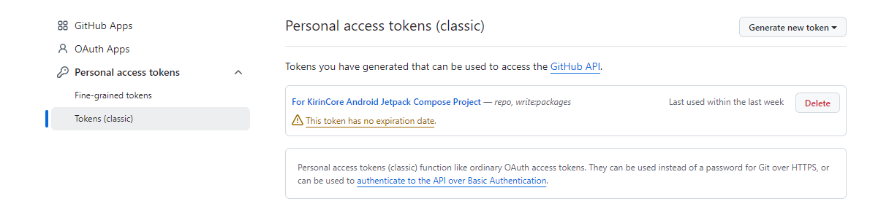

### 02.maven上传插件配置
在`libs.versions.toml`文件中增加 `maven-publish` 插件
```bash
[plugins]
maven-publish = { id = "maven-publish" }
```
在Android Library库中增加 `alias(libs.plugins.maven.publish)`
```bash
plugins {
    ...
    alias(libs.plugins.maven.publish)
}

这是 Gradle 的官方插件，用于将项目发布到 Maven 仓库（本地或远程）。

android {
  ....
}

# 与android块同级
afterEvaluate {
    publishing {
        publications {
            create<MavenPublication>("release") {
                from(components["release"])
                groupId = "com.kirincore.core"
                artifactId = "kirin-core"
                version = "1.0.0"
            }
        }
        // 添加仓库配置
        repositories {
            maven {
                name = "KirinCore"
                // 替换为你的实际仓库路径
                url = uri("https://maven.pkg.github.com/MeDeity/KirinCore")
                credentials {
                    username = githubUser ?: System.getenv("GPR_USER")
                    password = githubToken ?: System.getenv("GPR_TOKEN")
                }
            }
        }
    }
}
```

- 这是在项目配置完成后执行的。
- 定义了一个名为 `release` 的 Maven 发布物。
- `from components.release` 表示发布的是 Android Library 的 Release 变体。
- 指定了 Maven 坐标：
    - `groupId`: 组织名
    - `artifactId`: 项目名
    - `version`: 版本号
---

### 3. **如何触发发布？**
你需要在命令行中运行 Gradle 任务来发布：

- **发布到本地 Maven 仓库**（通常是 `~/.m2/repository`）：
```bash
./gradlew publishToMavenLocal
```

上传远程还需要我们进行一些用户配置,在library项目的build.gradle.kts中增加以下代码
```bash
import java.util.Properties

// 读取 local.properties
val localProperties = Properties()
val localPropertiesFile = rootProject.file("local.properties")
if (localPropertiesFile.exists()) {
    localPropertiesFile.inputStream().use { localProperties.load(it) }
}

val githubUser = localProperties.getProperty("gpr.user")
val githubToken = localProperties.getProperty("gpr.token")
```
主要是获取local.properties文件中的用户及token信息(这里的token是classic token),具体在 Github.com的以下路径进行配置

Setting->Developer Settings->Personal access tokens -> tokens (classic) 进行配置



- **发布到远程 Maven 仓库**（需配置 `repositories`）：
```bash
# 只构建 library，跳过 app
./gradlew :kirin-core:assembleRelease

# 只发布 library
./gradlew :kirin-core:publish
```

发布成功后


